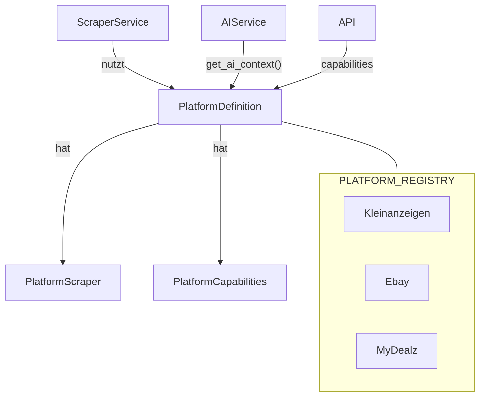

# Multi-Plattform Erweiterung fuer Schnappster

## Worum geht es?

Schnappster ist bisher eine reine Kleinanzeigen.de-App: Man gibt eine Kleinanzeigen-Such-URL ein, die App scrapt periodisch die Ergebnisse, analysiert sie per KI und zeigt Schnaeppchen im Dashboard an.

Diese Erweiterung macht Schnappster zur plattformuebergreifenden Schnaeppchen-Suchmaschine:

- **Statt URL-Eingabe** gibt der Nutzer direkt **Suchbegriffe** ein (z.B. "iPhone 15 Pro") und optional eine **PLZ mit Radius** (z.B. 51105, 50 km)
- Schnappster sucht dann **automatisch auf mehreren Plattformen** gleichzeitig: **Kleinanzeigen.de** (Privatverkauf), **eBay.de** (Auktionen + Sofort-Kaufen) und **MyDealz.de** (Community-Deals)
- Die KI-Analyse bewertet Angebote im **Kontext aller Plattformen** -- ein iPhone fuer 400 EUR auf Kleinanzeigen wird anders bewertet, wenn es auf eBay fuer 350 EUR zu haben ist
- Die Architektur wird als **Plugin-System** umgesetzt: Neue Quellen (z.B. Amazon, Vinted) koennen spaeter mit minimalem Aufwand hinzugefuegt werden, ohne bestehenden Code anzufassen

---

## Machbarkeitsanalyse

### Kleinanzeigen.de (bestehend -- Anpassung noetig)

- **Status**: Bereits implementiert, funktioniert zuverlaessig
- **Aenderung**: Statt URL-Eingabe werden Suchbegriffe + optionale PLZ/Radius verwendet
- **URL-Konstruktion**: `https://www.kleinanzeigen.de/s-{keywords}/k0?locationStr={PLZ}&radiusKm={radius}`
  Alternative mit Preis: `https://www.kleinanzeigen.de/s-preis:{min}:{max}/{keywords}/k0?locationStr={PLZ}&radiusKm={radius}`
- **Machbarkeit**: Hoch -- minimale Anpassungen am bestehenden Parser noetig

### eBay.de (neu)

- **URL-Konstruktion**: `https://www.ebay.de/sch/i.html?_nkw={keywords}&_sacat=0&_stpos={PLZ}&_sadis={radius}&_udlo={minPreis}&_udhi={maxPreis}`
- **HTML-Struktur**: Gut dokumentiert, Suchergebnisse mit strukturierten CSS-Klassen
- **Anti-Scraping**: eBay hat moderaten Bot-Schutz; curl-cffi (bereits im Projekt) mit Browser-Impersonation sollte ausreichen
- **Besonderheiten**: Auktionen vs. Sofort-Kaufen, Bewertungssystem (Sterne + Anzahl)
- **Machbarkeit**: Hoch -- gleicher technischer Ansatz wie Kleinanzeigen

### MyDealz.de (neu)

- **URL-Konstruktion**: `https://www.mydealz.de/search?q={keywords}`
- **HTML-Struktur**: React-basiert, aber serverseitig gerendert; Deals als Karten mit Titel, Preis, Temperatur-Score, Haendler
- **Besonderheit**: Keine Standort-Filterung (Deals sind online), Community-Temperatur statt Verkaeufer-Rating
- **Anti-Scraping**: Moderat, typische Cloudflare-Protection; curl-cffi sollte funktionieren
- **Machbarkeit**: Hoch -- HTML ist gut strukturiert, keine Detailseiten noetig (Deals sind vollstaendig auf der Suchseite)

### Risiken und Herausforderungen

1. **Wartungsaufwand x3**: Drei HTML-Parser pflegen statt einem; jede Plattform kann ihre Struktur aendern
2. **Request-Volumen**: 3x mehr HTTP-Requests pro Suchauftrag; Rate-Limiting pro Plattform empfehlenswert
3. **Datenmodell-Divergenz**: MyDealz-Deals haben grundlegend andere Felder als Kleinanzeigen/eBay-Privatverkauf-Anzeigen (Temperatur, Merchant, Gutscheincode vs. Verkaeufer-Rating, Zustand, VB)
4. **KI-Prompt-Anpassung**: Die Bewertungslogik muss pro Plattform unterschiedlich sein (Privatverkauf vs. Haendler-Deal)

---

## Architektur-Aenderungen

### Leitprinzip: Plugin-Architektur fuer Quellen

Jede Plattform ist ein eigenstaendiges Package mit klarer Trennung von Definition, Scraping-Logik und KI-Kontext. Der restliche Code (ScraperService, AIService, Frontend) arbeitet ausschliesslich mit abstrakten Interfaces.



### 1. Datenmodell: AdSearch (keyword-basiert statt URL)

Datei: `app/models/adsearch.py`

**Neue/geaenderte Felder:**

- `url` entfernen, ersetzen durch:
  - `search_query: str` -- Suchbegriff(e), z.B. "iPhone 15 Pro Max"
  - `postal_code: str | None` -- optionale PLZ fuer Standort-Filter
  - `radius_km: int | None` -- Radius in km (5, 10, 25, 50, 100, 200)
  - `platforms: str` -- komma-getrennt, z.B. "kleinanzeigen,ebay,mydealz" (Default: alle)
  - Convenience-Property `platform_list -> list[str]` fuer `platforms.split(",")`

### 2. Datenmodell: Ad (Quell-Plattform)

Datei: `app/models/ad.py`

**Neues Feld:**

- `source: str` -- Plattform-Bezeichner (z.B. "kleinanzeigen", "ebay", "mydealz")

**Plattform-spezifische Felder (pragmatischer Ansatz -- bestehende Felder wiederverwenden + wenige neue):**

- `seller_rating`: Bei eBay Feedback-Score (int 0-2 Mapping), bei Kleinanzeigen wie bisher
- `seller_type`: Bei eBay "privat"/"gewerblich", bei MyDealz Haendlername
- Neue optionale Felder: `deal_temperature: float | None` (MyDealz), `is_auction: bool` (eBay)

### 3. Plattform-Architektur: Package pro Quelle

```
app/platforms/
    __init__.py                      # PLATFORM_REGISTRY + get_platform() + get_all_platforms()
    _base.py                         # ABC + gemeinsame Dataclasses (siehe unten)
    kleinanzeigen/
        __init__.py                  # Re-Export: from .platform import Kleinanzeigen
        platform.py                  # class Kleinanzeigen(PlatformDefinition) -- ~30 Zeilen
        scraper.py                   # class KleinanzeigenScraper(PlatformScraper) -- bisheriger parser.py
    ebay/
        __init__.py                  # Re-Export: from .platform import Ebay
        platform.py                  # class Ebay(PlatformDefinition)
        scraper.py                   # class EbayScraper(PlatformScraper)
    mydealz/
        __init__.py                  # Re-Export: from .platform import MyDealz
        platform.py                  # class MyDealz(PlatformDefinition)
        scraper.py                   # class MyDealzScraper(PlatformScraper)
app/scraper/
    httpclient.py                    # bestehend, unveraendert
    parser.py                        # wird geloescht (Code wandert in platforms/kleinanzeigen/scraper.py)
```

**Basis-Abstraktionen `_base.py`:**

```python
@dataclass(frozen=True)
class SearchParams:
    """Buendelt alle Suchparameter in einem Objekt."""
    query: str
    postal_code: str | None = None
    radius_km: int | None = None
    min_price: float | None = None
    max_price: float | None = None

@dataclass(frozen=True)
class PlatformCapabilities:
    """Deklariert, was eine Plattform kann/braucht."""
    supports_location: bool = True
    needs_detail_fetch: bool = True
    supports_price_filter: bool = True
    platform_label: str = ""
    platform_color: str = ""


class PlatformScraper(ABC):
    """Reine Scraping-Logik: URL-Bau und HTML-Parsing."""

    @abstractmethod
    def build_search_url(self, params: SearchParams) -> str: ...

    @abstractmethod
    def parse_search_results(self, html: str) -> list[ScrapedAdPreview]: ...

    @abstractmethod
    def parse_next_page_urls(self, html: str) -> list[str]: ...

    @abstractmethod
    def parse_detail(self, html: str, url: str, external_id: str) -> ScrapedAdDetail | None: ...

    def parse_search_title(self, html: str) -> str | None:
        return None


class PlatformDefinition:
    """Buendelt alles, was eine Plattform ausmacht.
    Metadaten (name, capabilities) als ClassVars, Scraper als Instanz.
    __init_subclass__ prueft beim Import, dass alle Pflichtfelder gesetzt sind.
    """

    name: ClassVar[str]
    capabilities: ClassVar[PlatformCapabilities]
    scraper: ClassVar[PlatformScraper]

    def __init_subclass__(cls, **kwargs: Any) -> None:
        super().__init_subclass__(**kwargs)
        for attr in ("name", "capabilities", "scraper"):
            if not hasattr(cls, attr):
                raise TypeError(f"{cls.__name__} muss '{attr}' als Klassenattribut definieren")

    def get_ai_context(self, ad: ScrapedAdDetail) -> dict[str, Any]:
        """Plattform-spezifischer Kontext fuer den KI-Prompt.
        Subklassen koennen erweitern (z.B. MyDealz-Temperatur, eBay-Auktionstyp)."""
        return {"platform": self.name, "platform_label": self.capabilities.platform_label}
```

**Beispiel: MyDealz-Plattform**

`app/platforms/mydealz/platform.py`:

```python
class MyDealz(PlatformDefinition):
    name = "mydealz"
    capabilities = PlatformCapabilities(
        supports_location=False,
        needs_detail_fetch=False,
        supports_price_filter=False,
        platform_label="MyDealz",
        platform_color="#0044cc",
    )
    scraper = MyDealzScraper()

    def get_ai_context(self, ad):
        ctx = super().get_ai_context(ad)
        ctx["note"] = "Community-Deal von MyDealz, kein Privatverkauf. Temperatur = Community-Bewertung."
        return ctx
```

`app/platforms/mydealz/scraper.py`:

```python
class MyDealzScraper(PlatformScraper):
    def build_search_url(self, params: SearchParams) -> str:
        return f"https://www.mydealz.de/search?q={quote_plus(params.query)}"

    def parse_search_results(self, html): ...
    def parse_next_page_urls(self, html): ...
    def parse_detail(self, html, url, external_id):
        raise NotImplementedError("MyDealz braucht keine Detailseiten")
```

**Registry `app/platforms/__init__.py`:**

```python
from app.platforms.kleinanzeigen import Kleinanzeigen
from app.platforms.ebay import Ebay
from app.platforms.mydealz import MyDealz

PLATFORM_REGISTRY: dict[str, PlatformDefinition] = {
    "kleinanzeigen": Kleinanzeigen(),
    "ebay": Ebay(),
    "mydealz": MyDealz(),
}

def get_platform(name: str) -> PlatformDefinition:
    return PLATFORM_REGISTRY[name]

def get_all_platform_names() -> list[str]:
    return list(PLATFORM_REGISTRY.keys())

def get_all_capabilities() -> dict[str, PlatformCapabilities]:
    return {name: p.capabilities for name, p in PLATFORM_REGISTRY.items()}
```

### 4. ScraperService -- plattformunabhaengige Orchestrierung

Datei: `app/services/scraper.py`

Der ScraperService kennt keine konkreten Plattformen. Er arbeitet nur mit `PlatformDefinition`:

```python
def scrape_adsearch(self, adsearch: AdSearch) -> list[ScrapeRun]:
    params = SearchParams(
        query=adsearch.search_query,
        postal_code=adsearch.postal_code,
        radius_km=adsearch.radius_km,
        min_price=adsearch.min_price,
        max_price=adsearch.max_price,
    )
    runs = []
    for platform_name in adsearch.platform_list:
        platform = get_platform(platform_name)
        run = self._scrape_platform(adsearch, platform, params)
        runs.append(run)
    return runs

def _scrape_platform(self, adsearch, platform: PlatformDefinition, params: SearchParams) -> ScrapeRun:
    scraper = platform.scraper
    url = scraper.build_search_url(params)
    previews = self._collect_previews(url, scraper)
    new_previews = self._filter_known(previews, adsearch.id, platform.name)

    if platform.capabilities.needs_detail_fetch:
        details = self._fetch_details(new_previews, scraper)
    else:
        details = [self._preview_to_detail(p) for p in new_previews]

    filtered = self._filter_ads(details, adsearch)
    ads = self._save_ads(filtered, adsearch.id, source=platform.name)
    ...
```

### 5. KI-Analyse Anpassung

Datei: `app/services/ai.py`

- `get_ai_context()` pro Plattform liefert Kontext-Dict, das in den User-Prompt einfliesst
- System-Prompt bleibt generisch; plattformspezifischer Kontext kommt ueber `get_ai_context()`
- Vergleichspreise Cross-Platform: KI sieht Preise desselben Suchauftrags ueber alle Plattformen

### 6. API-Endpunkt fuer Plattform-Metadaten

Neuer Endpunkt `GET /api/platforms/` -- liefert dem Frontend die registrierten Plattformen mit Capabilities:

```json
{
  "kleinanzeigen": { "label": "Kleinanzeigen", "color": "#86b817", "supports_location": true, "..." : "..." },
  "ebay": { "label": "eBay", "color": "#e53238", "supports_location": true, "..." : "..." },
  "mydealz": { "label": "MyDealz", "color": "#0044cc", "supports_location": false, "..." : "..." }
}
```

Das Frontend baut Checkboxen, Filter und Badges dynamisch aus diesen Metadaten.

### 7. Frontend

- **Suchformular**: URL-Feld ersetzen durch Keyword-Eingabe + optionale PLZ/Radius + dynamische Plattform-Checkboxen (aus `/api/platforms/`)
- **Ad-Cards**: Source-Badge mit Farbe/Label aus Capabilities
- **Ad-Liste**: Plattform-Filter-Dropdown (dynamisch aus API)
- **Ad-Detail**: Plattformspezifische Anzeige (z.B. MyDealz-Temperatur, eBay-Auktionsinfo)

### Zusammenfassung: Was braucht man fuer eine neue Quelle?

```
1. Ordner app/platforms/neuesite/ anlegen
2. scraper.py  -- NeueSiteScraper(PlatformScraper) mit 4 Methoden
3. platform.py -- NeueSite(PlatformDefinition) mit name, capabilities, scraper + optionalem get_ai_context()
4. __init__.py -- Re-Export
5. app/platforms/__init__.py -- Import + Eintrag in PLATFORM_REGISTRY

Kein anderer Code muss angefasst werden.
Frontend, ScraperService, AIService passen sich automatisch an.
```

---

## Weitere Ideen und Verbesserungsvorschlaege

### Sofort umsetzbar (im Rahmen dieses Umbaus)

1. **Cross-Platform Preisvergleich**: KI bewertet ein Angebot im Kontext ALLER Plattformen -- "iPhone 15 auf Kleinanzeigen fuer 400 EUR ist gut, weil auf eBay 500 EUR"
2. **Plattform-spezifische Scrape-Intervalle**: MyDealz oefer pruefen (Deals sind zeitkritisch), eBay seltener
3. **Deal-Duplikat-Erkennung**: Gleiches Produkt auf mehreren Plattformen markieren

### Mittel- bis langfristig

1. **Idealo/Geizhals-Referenzpreis**: Automatisch den Neupreis als Benchmark fuer die KI-Bewertung abrufen
2. **Preis-Tracking ueber Zeit**: Preisverlauf pro Suchbegriff speichern und Trends erkennen
3. **eBay-Auktions-Alerts**: Benachrichtigung X Minuten vor Auktionsende bei Auktionen unter Zielpreis
4. **MyDealz-Hot-Deal-Alert**: Sofortige Benachrichtigung bei Deals mit hoher Temperatur (>200 Grad)
5. **Amazon-Integration**: Produkt-API fuer Preisvergleich (MWS/PA-API)
6. **Watchlist/Merkliste**: Produkte geraetuebergreifend merken und beobachten
7. **Automatische Kategorie-Erkennung**: KI ordnet Suchbegriffe Kategorien zu fuer praezisere Plattform-Suchen

---

## Empfohlene Umsetzungsreihenfolge

1. **Datenmodell** (AdSearch + Ad) -- Basis fuer alles, DB-Reset
2. **Basis-Abstraktionen** (`_base.py`) -- PlatformDefinition, PlatformScraper, SearchParams, Capabilities
3. **Kleinanzeigen-Plattform** -- bestehenden parser.py in `app/platforms/kleinanzeigen/` migrieren
4. **ScraperService** -- auf PlatformDefinition-Interface umstellen
5. **eBay-Plattform** -- `app/platforms/ebay/` (aehnlichste Struktur zu Kleinanzeigen)
6. **MyDealz-Plattform** -- `app/platforms/mydealz/` (einfachster Parser, keine Detailseiten)
7. **KI-Prompt-Anpassung** -- get_ai_context() in Prompts integrieren
8. **API-Routen** -- AdSearch-CRUD + Plattform-Endpunkt
9. **Frontend-Umbau** -- neues Suchformular + Source-Badges + Filter
10. **Tests** -- Parser-Tests pro Plattform mit HTML-Fixtures
